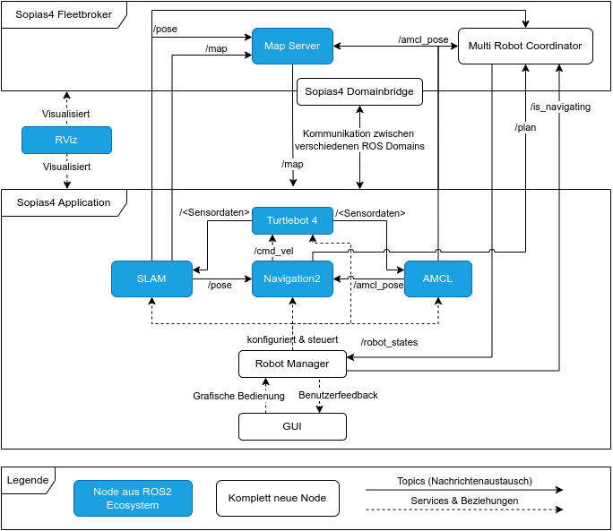

# Architecture of Sopias4

As seen in the picture above the general architecture of Sopias4 consists of two main parts: Sopias4 Application and Sopias4 Fleetbroker. The Fleetbroker runs exactly once in Sopias, but for each running and connected Turtlebot there must be one Sopias4 Application running. The Fleetbroker is already finished and provided. For Sopias4 Application there is a reference implementation available, however this part is the main goal of the lab course and should be developed by the teams. Following, a overview of these two sub-applications is given.

## Sopias4 Application
The Application provides nodes for the usecase of autonomous navigation and mapping. For mapping, the SLAM node is utilized. For autonomous navigation AMCL is used for localizing the Turtlebot, Rviz for visualization and Navigation2 for the navigation itself. The Turtlebot4 node runs on the physical robot and provides access to the needed sensors and actors. The Robot Manager is starting and steering these before mentioned nodes (except the Turtlebot Node) and it provides ROS2 services so a GUI can be connected and used.

For SLAM, AMCL and Rviz the Sopias4 Framework provides finished configurations which can be used. They are loaded by default when the corresponding launch files from Sopias4 Framework are used (see the guide for running the application). The Navigation 2 Stack can be configured with a YAML-File and uses plugins for the different parts of the stack. For these plugins there are already implementations available, however the goal of the lab is to write a own planner plugin and additional costmap layers. Finally a complete Navigation2 configuration must be provided which integrates the chosen and own implemented plugins.

The second big goal is to write a GUI with which you can interact with Sopias4 Application (see the guide for creating a GUI). This runs under the hood the Robot Manager which is started when you registered the namespace.

## Sopias4 Fleetbroker
The Fleetbroker is one central instance which runs exactly once in the whole system and is usually run on the server PC in the lab. However, for local testing it can theoretically be run from any machine which has setup the ROS2 environment. It serves a static map via the map server. The Multi Robot Coordinator is the instance where a namespace is registered and the states of all robots are gathered and then published to a topic. If the Turtlebot's are isolated into its own ROS Domain IDs, then the Sopias4 Domainbridge bridges all necessary topics and services which should be available across multiple ROS Domains (mainly the static map). This application is already available and can be started with a GUI. Typically there is no modification necessary.