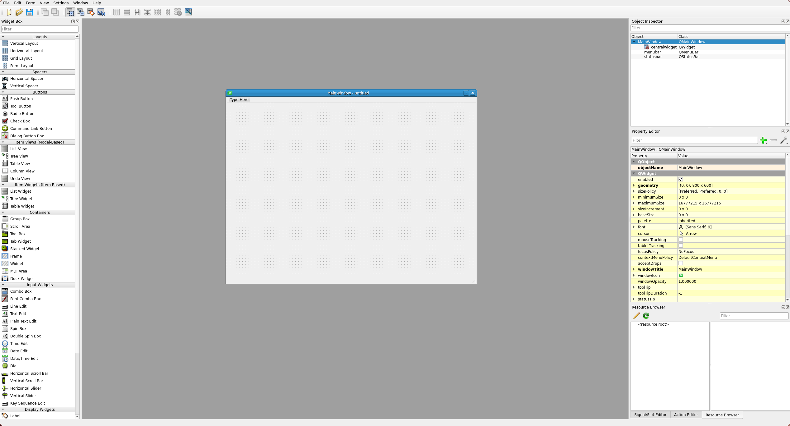

# Creating a GUI
This guide shows the process of creating a GUI with the tools which Sopias4 Framework provides. Technically, Sopias4 can be run with different kind of GUIs as long as it runs a ROS2 node in the background for communicating with the Robot Manager etc., however for these you have to create everything from scratch by your own and thus isn't the focus of this guide.

For creating and deploying a GUI, you have to do three steps:
1. Designing the UI with QT Designer
2. Converting the UI file to a Python Object
3. Connecting the Python GUI Object with the business logic e.g. connecting button presses with the execution of methods

In the following sections, these steps are described and helpful information and tips are given.

## Designing the UI
The UI can be designed graphically with the help of QT Designer. When using the development container, run `designer` in the terminal and the application should start and look like the picture below. Choose `Main Window` from the suggested templates and click `create`. You should be presented with an empty window and you can start dragging the desired UI elements into the window for adding them.



When adding a UI element, you can modify its properties with the yellow property inspector on the right pane:
1. When you want to interact with the UI element like doing something when the button is pressed, then you have to give it a unique `objectName` which is used in your code later to identify that UI element
2. Each kind of UI element have different type of properties to modify its look and behavior. Play around to get in what they do and change
3. With the keyboard shortcut `CTRL+R` you can open your currently designed UI and interact with it. This can be helpful for testing and visualization.

In the following subsections, some helpful information is given to make your GUI better. If you're finished with you UI, then save it to a location where you can find it again (like a assets folder inside Sopias4 Application).

### Responsive/resizable layout
The GUI can run on different kinds of screens with different kind of sizes. To make sure that all UI elements are visible in the right size on each screen, it is recommended to automatically resize all elements depending on the current window size. When following this tip, the designed UI should resize everything by its own.

The only thing you have to do is to place every UI element in a layout. For this, place a layout e.g. a vertical layout into the window and then drag your UI elements into it. You can also drag another layout into the layout e.g. you can drag a button into a vertical layout and under it a horizontal layout with three buttons in it to have one window-wide button and below that three buttons in one column. Make sure to also apply a layout to the most top UI element e.g. your central widget, however it can be helpful to do this as a last step because then it is easier to drag things into the existing layouts. You can also apply layouts by right-clicking on a widget and selecting a layout under the layout tab. 

### Using tabs
Placing all UI elements into one big window for all usecases of your application can get messy. One useful way for organizing these can be tabs. For this purpose, drag a tab widget into the centralwidget and create a tab for each usecase. Then each tab can be viewed as a new central widget for each of your usecases.

## Converting the UI file 
For this purpose, you can use a script which is provided in the Sopias4 Framework. It is located under `sopias4_framework/tools/scripts/generate_ui.py`. Assuming you are currently located on the top level of your ROS2 workspace in your terminal, simply run this command:
```bash
python3 src/sopias4_framework/sopias4_framework/tools/scripts/generate_ui.py -i <full path to your ui file > -o <path to where your python object should be located>
```

Usually you want to locate your Python object under `src/sopias4_application/sopias4_application` if you followed the naming convention required by this framework.

## Connecting the business logic
The Sopias4 Framework provides the `GUINode` which can be used to inherit from and does UI stuff under the hood. Following, a example implementation of your GUI is given:
```Python
#!/usr/bin/env python3
import logging
import os
import subprocess
import sys
from threading import Thread

from PyQt5.QtWidgets import QApplication
from sopias4_framework.nodes.gui_node import GUINode
from sopias4_framework.tools.gui.gui_logger import GuiLogger
from sopias4_framework.tools.gui.label_subscription_handle import (
    LabelSubscriptionHandler,
)

from sopias4_application.ui_object import Ui_MainWindow


class GUI(GUINode):
    def __init__(self) -> None:
        self.ui: Ui_MainWindow   # Needed for autocompletion
        super().__init__(Ui_MainWindow())

    def connect_ros2_callbacks(self):
        # Run everything that depends on ROS2 e.g. subscriptions
        GuiLogger(
            widget=self.ui.textEdit,
            node=self.node,
            namespace_filter=self.node.get_namespace(),
        ) 
        try:
            LabelSubscriptionHandler(
                widget=self.ui.label_battery, node=self.node, message_type=BatteryState
            )
        except Exception as e:
            self.node.get_logger().error(f"Couldn't add LabelSubscriptionHandler: {e}")

    def connect_ui_callbacks(self):
        # Connect the interactions of your UI with callback functions
        self.ui.pushButton_right.pressed.connect(
            lambda: Thread(
                target=self.drive(
                    direction="right",
                    vel_rel=float(self.ui.horizontalSlider_velocity.value() / 100),
                )
            ).start()
        )


    def set_default_values(self):
        # Set default values for UI elements like prefilled text of textfield's or elements of dropdown menus
        self.ui.comboBox_namespace.addItems(["/turtle1", "/turtle2", "/turtle3"])

    def set_initial_disabled_elements(self):
        # Disable elements which shouldn't be interactable at initial startup of the window e.g. buttons which shouldn't be pressed before another condition is met
        self.ui.pushButton_launch_turtlebot.setEnabled(False)

    def closeEvent(self, event):
        # Do stuff when the close button of the window is pressed
        super().closeEvent(event)

    def destroy_node(self):
        # Do stuff when the underlying node is destroyed
        super().destroy_node()


def main():
    app = QApplication(sys.argv)
    widget = GUI()
    widget.show()
    sys.exit(app.exec())


if __name__ == "__main__":
    main()
```

As you can see in the example code, there are three things you are doing in this step:
1. Connecting the UI interaction (mainly button presses) with business logic
2. Fill UI elements with values which weren't set in the design process
3. Reading values from the input UI elements when needed
In the following subsections, information for these steps are given.

Additionally you can see also following behaviors:
- The UI elements can be accesses via the `self.ui` attribute of the class. The UI elements are Python objects and are named like the objectName which you gave in the QT Designer
- All ROS2 specific things can be done by accessing the `self.node` attribute which is the underlying ROS2 node

### Connecting UI interactions
Currently, when you e.g. press a UI button, theres nothing that is executed in the background. For this purpose, the event of clicking a button must be connected with a function which gets executed. This executing function are called callback functions. For doing this, the scheme is like the following:
```Python
self.ui.<objectName of your UI element>.<event of the interaction>.connect(lambda: self.your_callback())
```
The objectName is the one which you gave your UI element during the UI design process in QT Designer. The event of the interaction is usually `clicked` in case of a button, but there exists more e.g. `pressed`. You can look into the PyQT5 documentation to get the available events called signals for each kind of UI element. For the callback function, following things should be considered:
- The UI hangs during the execution of the callback function. Thus if the callback could take some times, then consider using Threads for the long running tasks
- Don't forget to disable the UI element in the callback if the callback shouldn't be executed twice so e.g. the button isn't clickable again. The same applies to buttons which should get available/clickable when this button was pressed e.g. a Stop button
- The `GUINode` provides some useful callback function for the usecases for Sopias4 e.g. starting the Navigation2 stack. Look into the documentation for this class to get the available functions which can get called
- A example callback could do the following:
  1. Try to start the Navigation2 stack
  2. If successfully started, disable the button which starts the Navigation2 Stack
  3. Enable a button that can stop the running Navigation2 stack 

### Filling UI elements
Each UI elements has setters for setting values. These follow this scheme:
```Python
self.ui.<objectName of your UI element>.<setter function>
```
The objectName is the one which you gave your UI element during the UI design process in QT Designer. The setter function is specific to the UI element, but can be found in general in the PyQT5 documentation or by the suggestions of the code completion. Usually they are named self-explanatory e.g. `setText()`.

### Reading values
Each UI elements has getter for getting values. These follow this scheme:
```Python
self.ui.<objectName of your UI element>.<getter function>
```
The objectName is the one which you gave your UI element during the UI design process in QT Designer. The getter function is specific to the UI element, but can be found in general in the PyQT5 documentation or by the suggestions of the code completion. Usually they are named self-explanatory e.g. `getText()`.