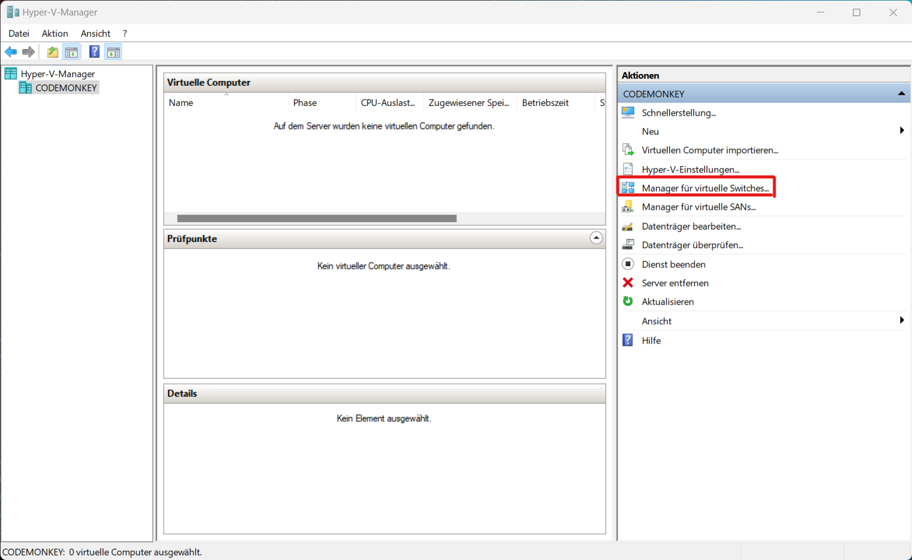
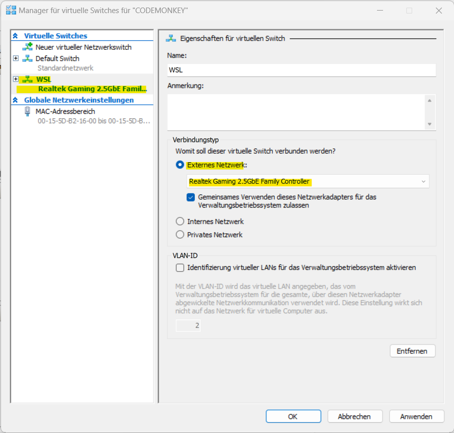

# Installation
This splits up into setting up a ROS2 workspace for the Sopias4 project and installing ROS2. It's recommended to first setup the workspace and then setting up ROS2, because the workspace contains necessary configuration files and installation scripts if you want to use the Dev Containers and Docker for easy setup or the WSL scripts for Windows.

## Setting up ROS2 workspace
Clone this repository. When using Linux, it is recommended to clone it into the home directory of your linux user so it matches with the commands in this guide. For this command, execute this commands:
```Bash
# If git isn't installed,
sudo apt update && apt install git

cd /home/<your linux user>
git clone https://github.tik.uni-stuttgart.de/IAS/sopias4_ws # Make sure the URL is right (can vary) 
```
If you use Windows and WSL2, then it is recommended to install WSL2 first and then clone it also under the home path inside your WSL2. This improves performance by a lot. However, you can also clone it directly on Windows first, install then WSL2 and copy it later inside WSL2. Your WSL2 instance is shown as `Linux` inside Windows File Explorer (choose your installed WSL2 distro which is Ubuntu by default).

After you have installed ROS2, you can follow the installation guide depending on your host operating system.

## Installing ROS2 and necessary applications 
### Recommended: Running in Docker using Dev Containers (Visual Studio Code)
Using Visual Studio Code and Docker Containers will enable you to run your favorite ROS 2 Distribution without the necessity to change your operating system or use a virtual machine.
If you want to use the pre-configured Dev Container, then the configuration is found in `.devcontainer/`. This also installs all required packages automatically on setup. However, a few steps are still needed:
1. Install `docker`   
    - For Ubuntu:
      - Run:
        ```Bash
        # 1. Required dependencies 
        sudo apt-get update 
        sudo apt-get -y install apt-transport-https ca-certificates curl gnupg lsb-release 

        # 2. GPG key 
        curl -fsSL https://download.docker.com/linux/ubuntu/gpg | sudo gpg --dearmor -o /usr/share/keyrings/docker-archive-keyring.gpg 

        # 3. Use stable repository for Docker 
        echo  "deb [arch=$(dpkg --print-architecture) signed-by=/usr/share/keyrings/docker-archive-keyring.gpg] https://download.docker.com/linux/ubuntu $(lsb_release -cs) stable" | sudo tee /etc/apt/sources.list.d/docker.list > /dev/null 

        # 4. Install Docker 
        sudo apt-get update 
        sudo apt-get -y install docker-ce docker-ce-cli containerd.io 
        ```
        You can verify your install by running
        ```bash
        sudo docker run hello-world
        ```
      - Add your current Linux user which is used inside the container to the docker group:
        ```bash
        sudo groupadd docker
        sudo usermod -aG docker $USER
        newgrp docker
        ```
    - For Windows: Follow the [Windows Docker setup guide](#install-docker-on-windows)
2. Open the workspace
3. If not done already: Download and install Visual Studio Code
4. In Visual Studio Code: Go to the extensions tab and install the extension Dev Containers
5. Set the `ROS_DOMAIN_ID` inside `devcontainer.json` to the number of the Turtlebot you want to control e.g. set it to 2 if you want to use /turtle2. Use the devcontainer-file which sits in the folder which represents your GPU (note: Nvidia is untested, remember that often the iGPU of the processor is configured to be used in Linux)
6.  Open Command Palette (either use `View->Command Palette...` or `Ctrl+Shift+P`), then search and/or run command `Dev Containers: (Re-)build and Reopen in Container`. Take the one which suits best for your platform 
7.  Lean back and take a coffee. The initial start of the environment can take a while (5-10 minutes)
8.  If you want to start the dev container in the future, simply open the workspace inside of Visual Studio code and then run the command from step 7

### Linux: Run directly on host (deprecated)
It is assumed that you use Ubuntu or another Ubuntu-based distribution. If you use another one, you have to adjust the `apt`-commands to the package manager of your distribution. 

Follow these steps:
1. Check if the variables inside of `install_sopias4_env.sh` are set right:
   - `USERNAME` must be the username of your Linux user 
   - `WORKSPACE` must be the absolute path to your Sopias4 workspace. Usually this is the place where you cloned this repository
   - Check if `ROS_DOMAIN_ID` is the one you plan to use. This can be changed afterwards manually, but this is the standard chosen one. The ROS Domain IDs are mapped to the namespaces e.g. /turtle1 is in ID 1
  2. After that, run that script with `sudo bash install_sopias4_env.sh`
  3. Install the recommended Visual Studio Code extensions by running following script with the command `bash install_extensions.sh` 
  4. Open a new Visual Studio Code instance and/or terminal session so the last changes are applied


### Install Docker on Windows
<!-- Its recommend to use Linux instead. If you have the opportunity to install Linux e.g. Dual Booting or inside a VM (don't forget to directly bridge the network directly to the VM), then you will have less pain.  -->

<!--If you stay in Windows, then you are basically using a worse version of Linux and run everything inside of that.  -->For following this installation guide, it is often said that you have to run command `xy` inside WSL2. This means that you either:
- Run inside a terminal which is run from your WSL2:
  - Open Windows search
  - Enter Ubuntu (standard) or how you named your WSL2 instance
  - A terminal opens where you can run commands inside your WSL2
- Run it from the integrated terminal when Visual Studio Code is connected with WSL:
  - Either type `code` inside your WSL2 terminal or open Visual Studio Code, press `CTRL+SHIFT+P` and  type `> WSL: Open Folder in WSL` (there select your workspace which should be located inside your WSL2 instance)
  - If everything went successful, then on the icon on bottom left should appear "WSL" (or similar)

To setup the environment, follow these steps:
1. [Download & Install Visual Studio Code](https://code.visualstudio.com/docs/setup/windows) <!--and the WSL extension inside of it -->
2. Install WSL2:
      - Open Powershell (or Terminal) as administrator
      - Run command `wsl --install`. This installs a Ubuntu-Subsystem
      - In pure Windows fashion, restart your computer
      - After the restart, a terminal should open a window and complete installation. You should be prompted to enter credentials for the new user. It doesnt matter, but make sure you can remember them as you can need them in the future
3. Install Docker (NOT Docker Desktop!):
     - Install Docker inside WSL2:
        ```Bash
        # 1. Required dependencies 
        sudo apt-get update 
        sudo apt-get -y install apt-transport-https ca-certificates curl gnupg lsb-release 

        # 2. GPG key 
        curl -fsSL https://download.docker.com/linux/ubuntu/gpg | sudo gpg --dearmor -o /usr/share/keyrings/docker-archive-keyring.gpg 

        # 3. Use stable repository for Docker 
        echo  "deb [arch=$(dpkg --print-architecture) signed-by=/usr/share/keyrings/docker-archive-keyring.gpg] https://download.docker.com/linux/ubuntu $(lsb_release -cs) stable" | sudo tee /etc/apt/sources.list.d/docker.list > /dev/null 

        # 4. Install Docker 
        sudo apt-get update 
        sudo apt-get -y install docker-ce docker-ce-cli containerd.io 

        # 5. Add user to docker group 
        sudo groupadd docker 
        sudo usermod -aG docker $USER 

        # 6. Start docker service:
        sudo service docker start
        ```
    - Delete the line `"credsStore": "desktop.exe"` inside the file `~/.docker/config.json` (if it exists)
    - Bind your Windows docker commands to WSL2 Docker:
      - Find your Powershell Profile by running `echo $PROFILE` inside powershell/windows terminal
      - Open that file and paste following content into it:
        ```Powershell
        Function Start-WslDocker {
            wsl docker $args
        }

        Function Start-WslDockerCompose {
            wsl docker-compose $args
        }

        Set-Alias -Name docker -Value Start-WslDocker

        Set-Alias -Name docker-compose -Value Start-WslDockerCompose
        ```
4. Enable Hyper-V: 
     - If running Windows 10/11 Home:
       - Run `enable_hyperv.bat` from this repository as an administrator by right clicking on it and choosing "run as administrator"
     - If running Windows 10/11 Pro:
       - Enter `Activate or deactivate Windows features`
       - Select Hyper-V
       - If Hyper-V is not shown, then follow the steps from Windows 10/11 Home
     - Restart computer
5. **Repeat this step every time when you restart windows and/or WSL2 and you need to connect to the Turtlebot:** Bridge the network inside to WSL2
     - Open Hyper-V Manager as administrator
     - On the right hand under "Actions" choose "Manager for virtual switches" (see picture below) 
     - Select the `wsl` adapter and choose "External network" and choose the network adapter you want to use e.g. your wifi adapter. Hit apply. A error can appear, often this can be fixed by clicking abort and retrying the whole operation or ignoring it because it was applied successfully anyways 
     - Run following commands inside WSL2:
       ```Bash
       sudo ip addr flush dev eth0
       sudo dhclient eth0
       ```
6. Configure network inside WSL2:
    - Run `sudo nano /etc/wsl.conf` and change the file so it looks like the following:
       ```Bash
       [boot]
       systemd=true

       [network]
       generateResolvConf=false
       ```
     - Run `sudo nano /etc/resolv.conf` and change it so it does look like that (it changes the DNS server to the one from the University Stuttgart because others are blocked by the firewall): 
        ```Bash
        # This file was automatically generated by WSL. To stop automatic generation of this file, add the following entry to /etc/wsl.conf:
        # [network]
        # generateResolvConf = false
        nameserver 8.8.8.8
        nameserver 129.69.252.252
        ```
<!-- 7. Run the steps from [the baremetal installation](#linux-run-directly-on-host-deprecated). Only apply following changes:
     - Run every command inside of WSL2
     - Open the workspace in Visual Studio Code via opening a folder inside of WSL2 -->
<!-- 8. If you want to reopen the workspace in the future, enter `code` inside your WSL2 terminal or open Visual Studio Code, press `CTRL+SHIFT+P` and  type `> WSL: Open Folder in WSL` (there select your workspace which should be located inside your WSL2 instance) -->

